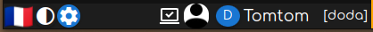

La **barre du haut** se présente ainsi:

La barre comporte trois boutons à gauche et la zone d'information sur le compte connecté à droite.

# Les boutons de gauche | panel_outils page_login_par

#### Changement de langue
Cliquer sur le drapeau correspondant à la langue souhaitée.

La _traduction_ en français est complète, celle en _anglais_ comporte 99% de français pour l'instant.

#### Clair / foncé
Choix du _thème_, **foncé** ou **clair**.

#### Boîte à outils
Ouverture du panneau de la boîte à outils ayant trois onglets:
- **Test d'accès** : divers test de type _ping_.
- **Comptes synchronisées**: liste des bases locales des comptes ayant une session synchronisée et suppression des bases obsolètes ou indésirables.
- **Tester une phrase secrète**, plus exactement en obtenir lesclés et hash correspondants.

#### Verrouillage de l'écran de l'application
L'icône **Verrou** verrouille l'écran jusqu'à saisie du code PIN de déverrouillage saisi à la connexion, du moins s'il en a été déclaré un. Voir la rubrique d'aide citée ci-dessus.

# A propos du compte connecté | page_login_m
Si aucun compte n'est connecté il apparaît le texte _pas de compte connecté_.

L'icône à gauche indique le mode de connexion:
- **synchronisé**,
- **incognito**,
- **avion**.

La **photo** de l'avatar principal du compte apparaît ensuite (s'il en a une).

Enfin son **nom** et le code de l'organisation.
