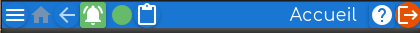
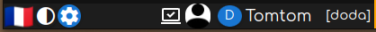

la _page d'accueil_ est celle affichée après connexion à un compte:
- on peut y revenir par appui sur l'icône verte _maison_ présente dans la barre du haut à gauche.

# Barres en haut et en bas | top_bar bottom_bar
Barre du haut: 

Barre du bas: 

 
# Zone de navigation _supérieure_
Elle reprend les actions qui peuvent être activées depuis les barres du haut et du bas avec un libellé plus explicite à côté de l'icône correspondante.

La page _Alertes et abonnement ..._ a quatre onglets: 
- Alertes,
- Abonnement et consommation,
- Crédits (pour les comptes A et le Comptable seulement),
- Chats d'urgence.

La zone de navigation donne la possibilité d'ouvrir directement l'un de ces onglets.

# Zone de navigation _inférieure_ | menu_navigation

Elle reprend exactement le _Menu de navigation_ qui permet simplement de naviguer directement depuis n'importe quelle page sans avoir à repasser par la page d'accueil.
